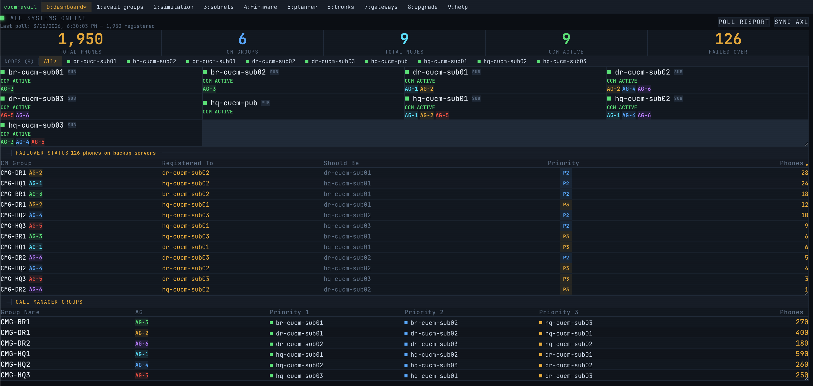
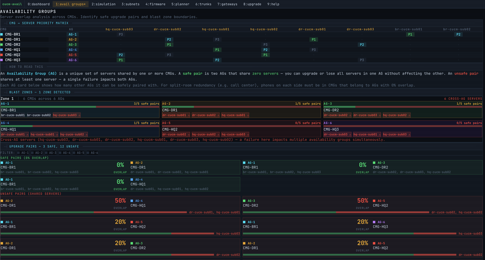
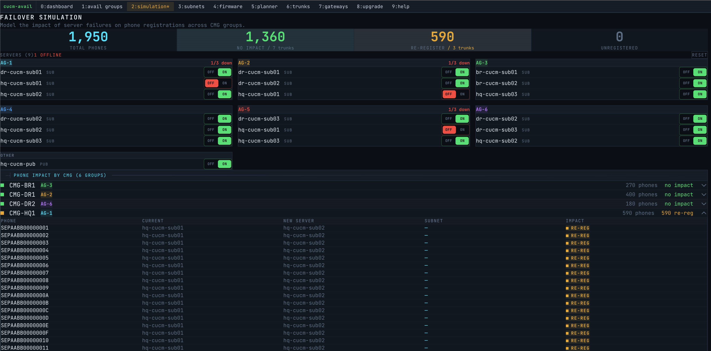
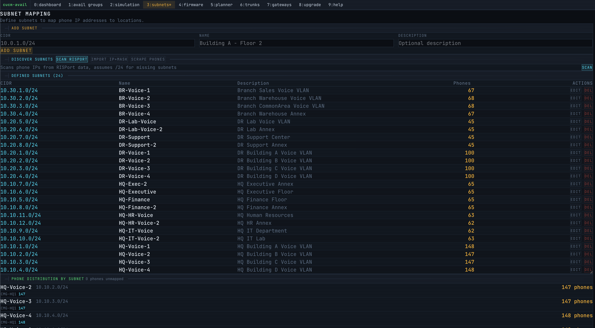
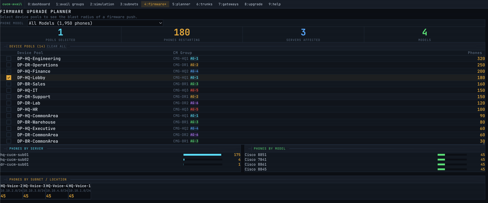
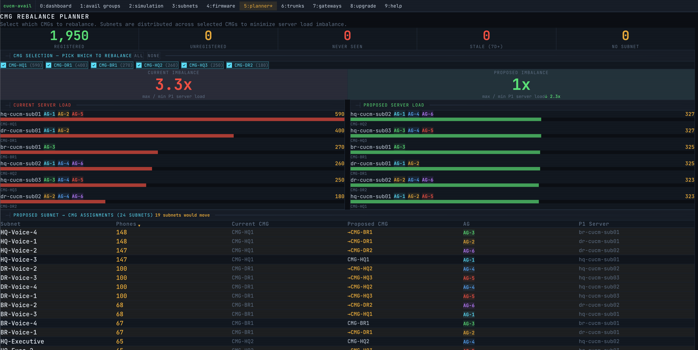
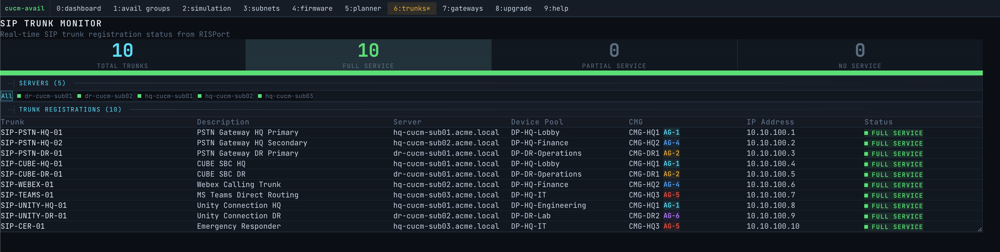
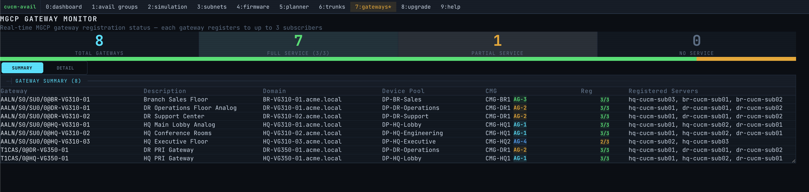
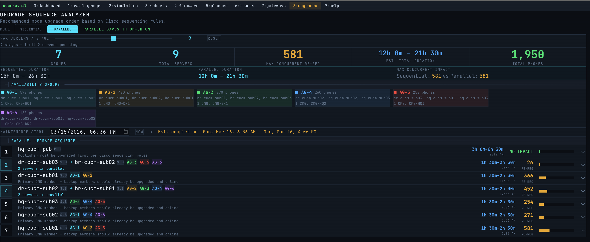
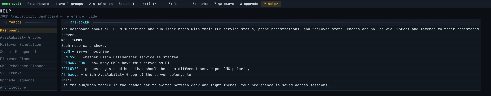

# CUCM Availability Dashboard

Real-time visibility into Cisco Unified Communications Manager (CUCM) phone registration, failover status, and upgrade planning.


## Screenshots

### Dashboard

The main dashboard shows all CUCM subscriber and publisher nodes with their CCM service status, phone registration counts, and failover state. Phones are polled via RISPort and matched to their registered server. The **Failover Status** section highlights phones registered to a backup server instead of their primary — click any row to drill down to individual phones.



### Availability Groups

Availability Groups (AGs) identify which CM Groups share the same set of servers. This matters because servers in the same AG can't be upgraded simultaneously — taking one down affects all CMGs in that group. The page shows a **priority matrix** (which server is P1/P2/P3 for each CMG), **safe upgrade pairs** (AGs that share no servers and can be upgraded in parallel), and a **blast zone analysis** showing what percentage of phones are affected if servers in each AG go down.



### Failover Simulation

Toggle servers on/off to model what happens to phone registrations during a failure. When you disable a server, the simulator calculates which phones re-register to a backup server vs. which lose service entirely (if all servers in their CMG are down). The per-CMG breakdown and individual phone table show the full impact. Trunk impact is also calculated.



### Subnet Mapping

Maps phone IP addresses to named subnets/locations using CIDR ranges. Use **Discover Subnets** to auto-detect /24 blocks from registration data, or manually add CIDRs. The distribution table shows phone counts per subnet broken down by CM Group — useful for understanding geographic distribution and planning subnet-based device pool assignments.



### Firmware Upgrade Planner

Select one or more device pools to see the blast radius of a firmware push. The breakdown shows which servers will see phone restarts, which phone models are affected, and which subnets/locations will experience disruptions. Filter by phone model to scope a firmware push to specific hardware.



### CMG Rebalance Planner

Analyzes current server load distribution across CM Groups and proposes subnet-based rebalancing. The left side shows the **current state** with imbalance ratio (e.g., 3.3x means the busiest server has 3.3x the load of the lightest). The right side shows the **proposed state** after bin-packing subnets into CMGs to minimize imbalance. The table below maps each subnet to its current and proposed CMG assignment.



### SIP Trunk Monitor

Real-time SIP trunk registration status from RISPort. Filter by server to see which trunks are registered where. Each trunk shows its device pool, CM Group, AG badge, IP address, and service status (Full Service = registered, Partial = unregistered from one server, No Service = down).



### MGCP Gateway Monitor

MGCP gateways register to up to 3 subscribers simultaneously (unlike phones which register to one). The **Summary** view shows each gateway with its registration count (e.g., 3/3 = full service) and which servers it's registered to. The **Detail** view shows individual gateway-to-server registration pairs. Requires `ENABLE_GATEWAYS=true`.



### Upgrade Sequence Analyzer

Calculates the optimal order to upgrade CUCM subscribers with minimal phone disruption. Supports **Sequential** (one server at a time) and **Parallel** (safe pairs from AG analysis upgraded together) modes. Each step shows estimated duration, re-registration count, and affected CMGs. The parallel mode groups servers from independent AGs to cut total upgrade time roughly in half.



### Help

Built-in reference guide explaining each page, terminology (FQDN, CCM SVC, Primary For, Failover, AG badges), and navigation.



### Status Bar

The tmux-style status bar shows connection state, poll interval, real-time poller/RISPort log messages (click to expand history), and a live clock. During subnet scraping, progress is shown inline.


## Features

- **Dashboard** — Live server status, phone registration counts, and failover detection with drill-down to individual phones
- **Availability Groups** — Visualize how CM Groups share servers with priority matrix, blast zone analysis, and safe upgrade pair identification
- **Failover Simulation** — Toggle servers offline to model phone re-registration impact across CMGs and subnets
- **Upgrade Sequencer** — Calculate optimal sequential or parallel upgrade order with estimated duration and phone impact per step
- **SIP Trunk Monitor** — Real-time trunk registration status with per-server filtering
- **MGCP Gateway Monitor** — Multi-subscriber gateway registration tracking (requires `ENABLE_GATEWAYS=true`)
- **Firmware Planner** — Blast radius analysis for firmware pushes by model and device pool
- **CMG Rebalance Planner** — Subnet-based bin-packing to minimize server load imbalance across CM Groups
- **Subnet Management** — CIDR-based location mapping with automatic subnet discovery via phone scraping

## Architecture

```
┌─────────────┐     AXL/SOAP      ┌──────────────┐
│  CUCM Pub   │◄──────────────────│              │
│  + Subs     │     RISPort       │   Express    │
│             │◄──────────────────│   Server     │
└─────────────┘                   │              │
                                  │  Socket.IO   │──► SQLite
┌─────────────┐     HTTP          │              │
│  IP Phones  │◄──────────────────│              │
│  (scrape)   │                   └──────┬───────┘
└─────────────┘                          │
                                         │ REST + WS
                                  ┌──────┴───────┐
                                  │    React     │
                                  │   Frontend   │
                                  └──────────────┘
```

- **AXL** — Syncs servers, device pools, CM Groups, phones, trunks, and gateways from CUCM admin SOAP API
- **RISPort** — Polls real-time registration status (which server each phone/trunk/gateway is on)
- **Phone Scrape** — HTTP to phone web servers for subnet mask discovery
- **Socket.IO** — Pushes registration updates, poller logs, and scrape progress to the browser

## Quick Start with Docker

No need to clone the repo — download the compose files directly and run:

```bash
mkdir cucm-avail && cd cucm-avail
wget https://raw.githubusercontent.com/sieteunoseis/CUCM-AVAIL/main/docker/docker-compose.yml
wget https://raw.githubusercontent.com/sieteunoseis/CUCM-AVAIL/main/docker/.env.example -O .env
# Edit .env with your CUCM credentials
docker compose up -d
```

Open [http://localhost:3000](http://localhost:3000)

### Demo Mode

Run with sample data (no CUCM required) for evaluation or screenshots:

```bash
docker run -p 3000:3000 -e DEMO_MODE=true -e ENABLE_GATEWAYS=true ghcr.io/sieteunoseis/cucm-avail:latest
```

This seeds ~2,000 phones across 3 datacenters, 6 CM Groups, 10 SIP trunks, 8 MGCP gateways, and 24 subnets. All polling and sync are disabled.

## Docker Image

Pre-built images are published to GitHub Container Registry on every tag:

```bash
docker pull ghcr.io/sieteunoseis/cucm-avail:latest
```

## Development

### Prerequisites

- Node.js 22+
- npm 10+
- Access to a CUCM cluster (AXL + RISPort APIs)

### Setup

```bash
git clone https://github.com/sieteunoseis/CUCM-AVAIL.git
cd CUCM-AVAIL

# Install dependencies
npm install
cd client && npm install && cd ..

# Configure environment
cp docker/.env.example .env
# Edit .env with your CUCM credentials

# Run dev server (poller disabled)
npm run dev

# Run dev server (with RISPort polling)
npm run dev:full
```

The client dev server runs on `:5173` and the API server on `:3000`.

### Initial Data Sync

On first run, trigger an AXL sync to pull server/CMG/phone data:

```bash
npm run sync
```

Or use the **Sync AXL** button on the dashboard.

### Build for Production

```bash
npm run build
npm start
```

## Environment Variables

| Variable | Required | Default | Description |
|---|---|---|---|
| `CUCM_PUB` | Yes | — | CUCM publisher FQDN or IP |
| `CUCM_USERNAME` | Yes | — | AXL API username |
| `CUCM_PASSWORD` | Yes | — | AXL API password |
| `CUCM_VERSION` | No | `15.0` | CUCM AXL schema version |
| `PORT` | No | `3000` | HTTP server port |
| `DB_PATH` | No | `./data/prod.db` | SQLite database file path |
| `POLL_INTERVAL` | No | `1440` | RISPort poll interval in minutes |
| `ENABLE_GATEWAYS` | No | `false` | Enable MGCP gateway monitoring |
| `DEMO_MODE` | No | `false` | Seed sample data, disable all CUCM calls |

## Tech Stack

- **Frontend**: React 19, Tailwind CSS 4, Vite 8, Socket.IO Client
- **Backend**: Express 4, Socket.IO, better-sqlite3
- **CUCM APIs**: [cisco-axl](https://www.npmjs.com/package/cisco-axl), [cisco-risport](https://www.npmjs.com/package/cisco-risport)
- **Infrastructure**: Docker, GitHub Actions, GHCR
